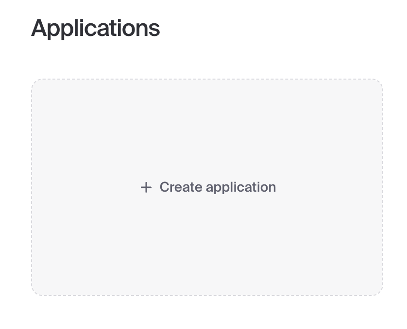
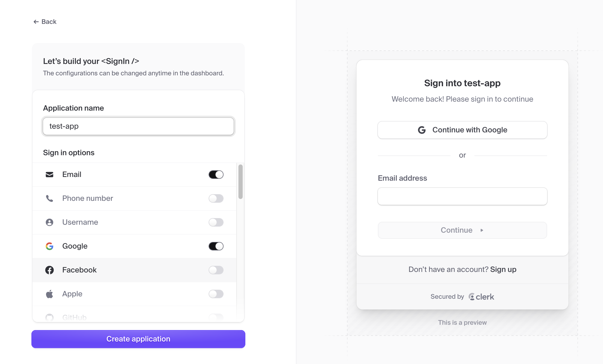
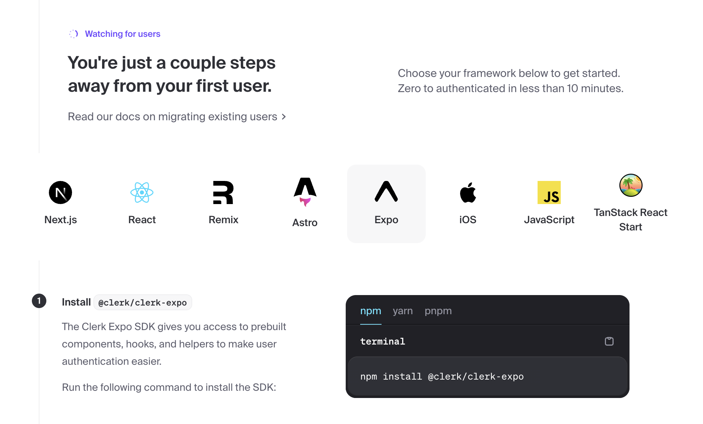
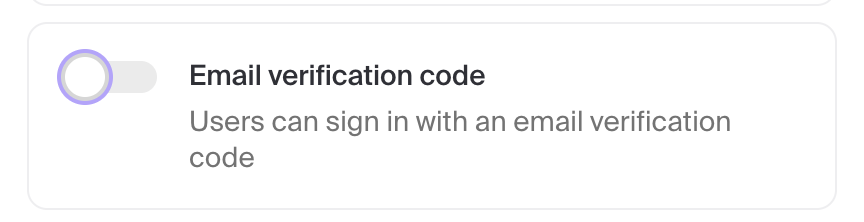
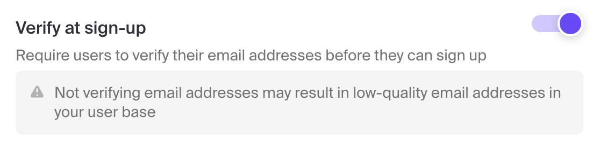

# learn-react-native

Repositorio para aprender React Native con backend de Supabase y login con Clerk

- [Supabase](https://supabase.com/), es un servicio de Backend que se puede integrar con proyectos de front-end de varios stacks mediante integraciones o usando REST API
- [Clerk](https://clerk.com/), es un servicio de autenticación para proyectos de front-end, una especia de Auth-as-a-Service, que ofrece componentes listos para usar

- [Plantilla de .gitignore](./.gitignore) para React Native

## 1. Crear proyecto

```bash
  npx create-expo-app clerk-demo
  cd clerk-demo
  # Según que plataforma queremos usar:
  
  # npm run android
  # npm run ios
  npm run web

  # Reinicio del proyecto:
  npm run reset-project
  npm i
  # Se borran muchos archivos de ejemplo del proyecto
```

## 2. Integración de Clerk

```bash
# Instalamos dependencias necesarias:
npx expo install expo-secure-store react-native-reanimated react-native-gesture-handler

# La salida será algo similar a:
# ...
# › Added config plugin: expo-secure-store

# Instalamos esta dependencia:
npm install @clerk/clerk-expo
```

### 2.1 Crear cuenta en Clerk

- Crear una cuenta en [https://clerk.dev](https://clerk.dev)
- Crear una nueva aplicación:



Configurar opciones:



Una vez creada la app, aparecen los pasos para la integración (seleccionamos Expo):




- Obtener tu Publishable Key:

Crear un archivo `.env` (debe llamarse exactamente así) y colocamos dentro el api key:

```bash
  EXPO_PUBLIC_CLERK_PUBLISHABLE_KEY=pk_test_...
```

### 2.2 Componentes

```bash
# Dependencia para el ejemplo con react-navigation:
npx expo install @react-navigation/native @react-navigation/native-stack
```

Seguimos los pasos del tutorial que aparece en el paso tras crear la app o podemos usar el [template de Clerk](https://github.com/clerk/clerk-expo-quickstart)

[Ejemplo funcional](./clerk-expo-quickstart/)

### 2.3 Pruebas

Si queremos dejar de recibir un código de verificación para pruebas hay que desactivar:





Vamos a `sign-up` para crear un usuario y lo probamos (una vez creado) en `sign-in`
