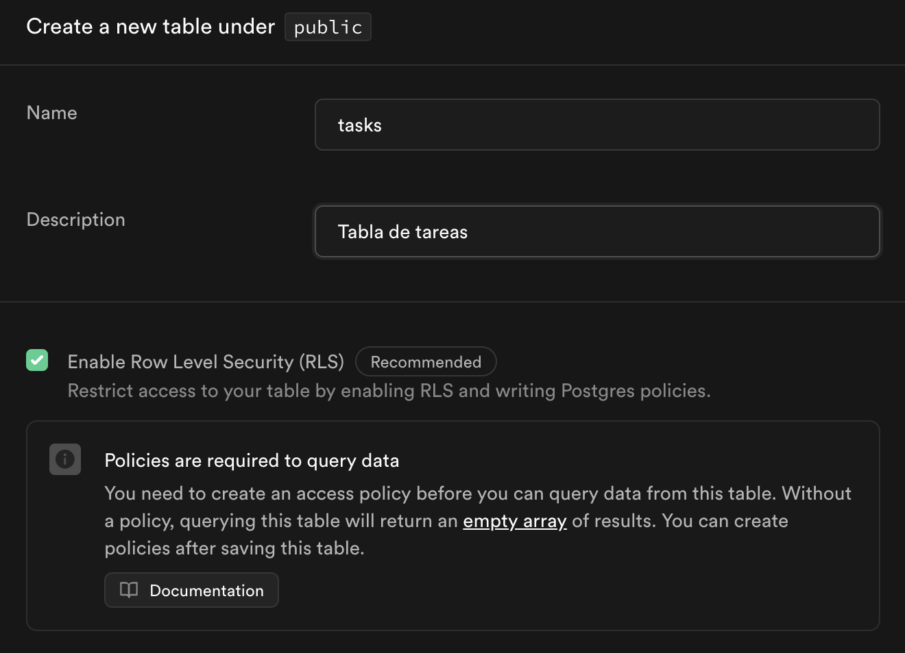
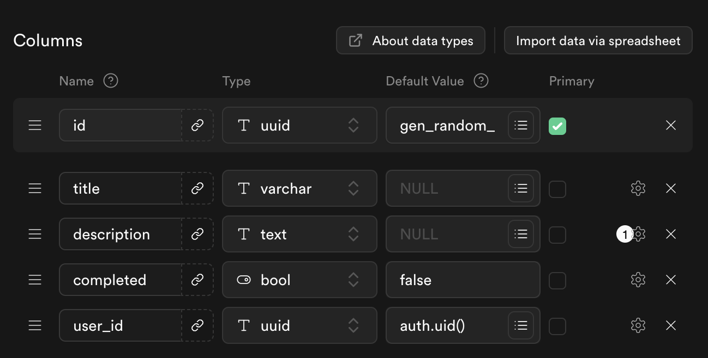
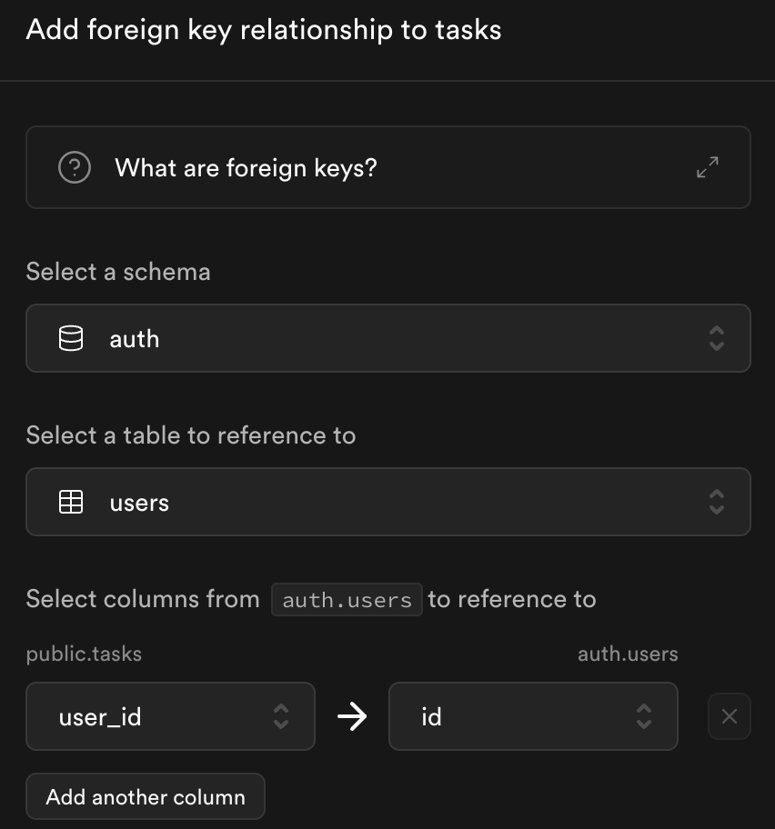
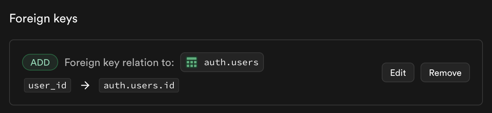
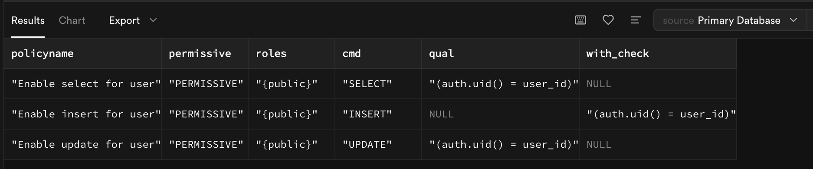

### **Guía: CRUD Básico con Supabase y React Native Web**

---

## **Objetivo**
Crear una funcionalidad básica para gestionar una lista de tareas con un backend en Supabase y un frontend en React Native Web.

---

## **Pasos**

### **1. Configuración del Backend (Supabase)**

#### **1.1 Crear un proyecto en Supabase**

1. Ve a [Supabase](https://supabase.com/) y crea una cuenta si aún no tienes una.

2. Crea un nuevo proyecto y anota la URL del proyecto y la clave de la API (found in Project Settings > API).

#### **1.2 Crear la tabla `tasks`**

1. Ve a la sección **"Table Editor"** y crea una nueva tabla llamada `tasks`.



2. Define las columnas como sigue:

   - `id`: UUID (Primary Key, default value: `gen_random_uuid()`)
   - `title`: Varchar
   - `description`: Text (opcional)
   - `completed`: Boolean (default: `false`)
   - `user_id`: UUID (foreign key, referencia a la tabla `auth.users`), value: `auth.uid()`







#### **1.3 Activar Row-Level Security (RLS)**
1. En la tabla `tasks`, habilita **Row-Level Security (RLS)**. También es posible habilitar esta opción desde SQL Editor:

```sql
  ALTER TABLE tasks ENABLE ROW LEVEL SECURITY;
```

2. Crea una política para que los usuarios solo puedan ver sus propias tareas:

```sql
  CREATE POLICY "Enable select for user" ON tasks
  FOR SELECT
  USING (auth.uid() = user_id);
```

Comprobación de los policies:

```sql
  SELECT policyname, permissive, roles, cmd, qual, with_check 
  FROM pg_policies 
  WHERE tablename = 'tasks';
```

El resultado debe ser similar a:



3. Crea otra política para permitir INSERT/UPDATE (inserción/actualización) solo a los propietarios:
```sql
  CREATE POLICY "Enable insert for user"
  ON tasks
  FOR INSERT
  WITH CHECK (auth.uid() = user_id);
```

```sql
  CREATE POLICY "Enable update for user"
  ON tasks
  FOR UPDATE
  USING (auth.uid() = user_id);
```
---

### **2. Configuración del Frontend (React Native Web)**

#### **2.1 Crear el proyecto React Native Web**
1. Inicializa un proyecto:

```bash
  npx create-expo-app tasks-app
  cd tasks-app
```

Para ejecutar el proyecto:

```bash
  npm run ios
  npm run android
  npm run web
```

2. Instala las dependencias necesarias:
```bash
   npm install @supabase/supabase-js react-native-web react-native-gesture-handler
```

#### **2.2 Configurar Supabase en el proyecto**
1. Crea un archivo `supabaseClient.js` en la raíz del proyecto:
   ```javascript
   import { createClient } from '@supabase/supabase-js';

   const SUPABASE_URL = 'https://<your-project-id>.supabase.co';
   const SUPABASE_KEY = '<public-anon-key>';

   export const supabase = createClient(SUPABASE_URL, SUPABASE_KEY);
   ```
2. Sustituye `<your-project-id>` y `<public-anon-key>` con tu URL y clave pública de Supabase.

---

### **3. Crear la funcionalidad CRUD**

#### **3.1 Listar tareas**
1. Crea un componente `TaskList` que haga una consulta a Supabase:
   ```javascript
   import React, { useEffect, useState } from 'react';
   import { supabase } from './supabaseClient';

   const TaskList = () => {
     const [tasks, setTasks] = useState([]);

     useEffect(() => {
       const fetchTasks = async () => {
         const { data, error } = await supabase
           .from('tasks')
           .select('*')
           .order('id', { ascending: false });
         if (!error) setTasks(data);
       };

       fetchTasks();
     }, []);

     return (
       <ul>
         {tasks.map((task) => (
           <li key={task.id}>
             {task.title} - {task.completed ? '✅' : '❌'}
           </li>
         ))}
       </ul>
     );
   };

   export default TaskList;
   ```

#### **3.2 Crear/Editar tareas**
1. Crea un componente `TaskForm` para manejar la creación y edición:
   ```javascript
   const TaskForm = ({ onSave }) => {
     const [title, setTitle] = useState('');
     const [description, setDescription] = useState('');

     const handleSubmit = async () => {
       const { error } = await supabase.from('tasks').insert([{ title, description }]);
       if (!error) onSave();
     };

     return (
       <div>
         <input
           type="text"
           placeholder="Título"
           value={title}
           onChange={(e) => setTitle(e.target.value)}
         />
         <textarea
           placeholder="Descripción"
           value={description}
           onChange={(e) => setDescription(e.target.value)}
         ></textarea>
         <button onClick={handleSubmit}>Guardar</button>
       </div>
     );
   };
   ```

#### **3.3 Completar tareas**
1. Añade una función para marcar tareas como completadas:
   ```javascript
   const markAsCompleted = async (id) => {
     const { error } = await supabase.from('tasks').update({ completed: true }).eq('id', id);
     if (error) console.error(error);
   };
   ```

#### **3.4 Eliminar tareas**
1. Implementa una función para eliminar tareas:
   ```javascript
   const deleteTask = async (id) => {
     const { error } = await supabase.from('tasks').delete().eq('id', id);
     if (error) console.error(error);
   };
   ```

---

### **4. Retos (Pistas)**

#### **4.1 Paginación**
- Usa la función `range` de Supabase para limitar los resultados:
  ```javascript
  const { data, error } = await supabase
    .from('tasks')
    .select('*')
    .range(0, 9); // Primeros 10 resultados
  ```

#### **4.2 Filtrar tareas**
- Usa la función `eq` para filtrar tareas completadas o no completadas:
  ```javascript
  const { data, error } = await supabase
    .from('tasks')
    .select('*')
    .eq('completed', false); // Solo tareas no completadas
  ```

---

### **5. Extras**
- Añade validaciones en el formulario de creación/edición.
- Implementa un spinner mientras se cargan los datos.
- Mejora la UI con una librería como TailwindCSS o Material-UI.

--- 

### **¡Finalizado!** 
Al completar esta práctica, habrás creado una app funcional con Supabase y React Native Web. 🎉