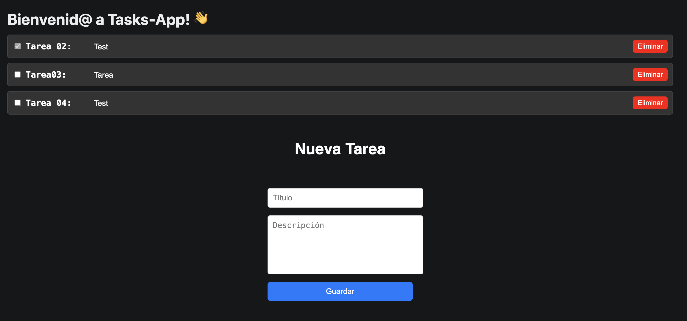

# 3. Crear la funcionalidad CRUD

**Nota:** Hasta el momento, hemos usado las variables `SUPABASE_URL` y `SUPABASE_KEY` en 
`supabaseClient.js` para acceder a los datos necesarios para conectar al backend 
de Supabase. Si bien esto se puede hacer en desarrollo, en general, no es lo mejor 
ya que no queremos exponer claves de API en repositorios o proyectos. 
Ver [gestión de keys](./gestion_keys.md) para resolver esta situación.

**Nota:** hasta ahora hemos ejecutado `npm run web` o `npm run start` > <kbd>w</kbd> para probar el build en el navegador. Sin embargo, los componentes de web no se renderizan de forma correcta en móviles. 
Para habilitar el build de móvil hay que modificar los componentes a los equivalentes de React Native, más detalle sobre estos cambios en [Adaptación a Mobile](./adaptacion_mobile.md).

---

## 3.1 Listar tareas

1. Crea un componente `TaskList` que haga una consulta a Supabase:

   ```javascript
   import React, { useEffect, useState } from 'react';
   import { supabase } from './supabaseClient';

   const TaskList = () => {
     const [tasks, setTasks] = useState([]);

     useEffect(() => {
       const fetchTasks = async () => {
         const { data, error } = await supabase
           .from('tasks')
           .select('*')
           .order('id', { ascending: false });
         if (!error) setTasks(data);
       };

       fetchTasks();
     }, []);

     return (
       <ul>
         {tasks.map((task) => (
           <li key={task.id}>
             {task.title} - {task.completed ? '✅' : '❌'}
           </li>
         ))}
       </ul>
     );
   };

   export default TaskList;
   ```

## 3.2 Crear/Editar tareas

1. Crea un componente `TaskForm` para manejar la creación y edición:

   ```javascript
   const TaskForm = ({ onSave }) => {
     const [title, setTitle] = useState('');
     const [description, setDescription] = useState('');

     const handleSubmit = async () => {
       const { error } = await supabase.from('tasks').insert([{ title, description }]);
       if (!error) onSave();
     };

     return (
       <div>
         <input
           type="text"
           placeholder="Título"
           value={title}
           onChange={(e) => setTitle(e.target.value)}
         />
         <textarea
           placeholder="Descripción"
           value={description}
           onChange={(e) => setDescription(e.target.value)}
         ></textarea>
         <button onClick={handleSubmit}>Guardar</button>
       </div>
     );
   };
   ```

## 3.3 Completar tareas

1. Añade un checkbox y una función para marcar tareas como completadas:

   ```javascript
   const markAsCompleted = async (id) => {
     const { error } = await supabase.from('tasks').update({ completed: true }).eq('id', id);
     if (error) console.error(error);
   };
   ```

## 3.4 Eliminar tareas

1. Implementa una función para eliminar tareas:
   ```javascript
   const deleteTask = async (id) => {
     const { error } = await supabase.from('tasks').delete().eq('id', id);
     if (error) console.error(error);
   };
   ```

El resultado:



---

Paso anterior: [Conexión a Supabase](./02.conexion_a_supabase.md)
|
Siguiente paso: [Retos](./04.retos.md)